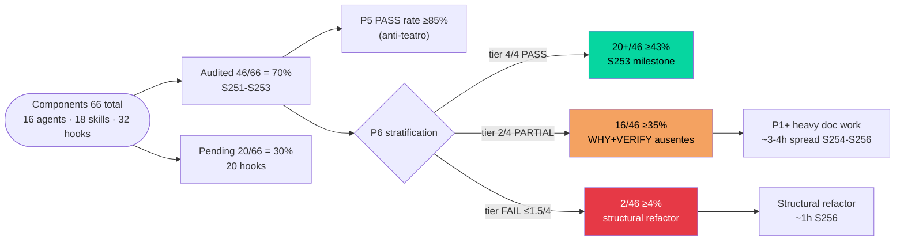

# S253+S254 Continuation — agents/skills/hooks audit + VERIFY + KPI infra + Mermaid DAG

> **Plan ID:** fancy-imagining-crab (re-used post-S252 archive)
> **Sessions:** S253 (Phases 1-3) + S254 (Phases 4-6)
> **Scope confirmed:** continuação granular Conductor 2026 — agents + subagents + skills + KPI + DAG (Lucas request 2026-04-25)
> **Non-destructive throughout** — D/E/F/G destrutivos defer S255+

---

## Context

S252 "infra2" entregou (5 commits cb4c863→e4858f9):
- **P0(c) calibrate:** 12/12 KPI thresholds Lucas-confirmed
- **P0(d) audit:** batch F 8 components → 38/66 (58%); agents milestone 16/16 = 100%
- **P1 first PASSes:** 6 P6 PASS (debug-team subgraph + mbe-evaluator); conversion 6/8 = 75%
- **KBP-39 codified** (audit-merge convergence rules; pointer-only KBP-16 enforced)
- **fancy-imagining-crab S252 archived**

State pós-S252:
- Audit: 38/66 (58%) — pendentes 28 (8 skills + 20 hooks; agents COMPLETE)
- P6 stratification (5-tier): 4/4 PASS=6 · 3.5/4=2 · 3/4=12 · 2/4=16 · FAIL=2
- KPI: 12 calibrated; snapshot infra `.claude/metrics/snapshots/2026-04-26.tsv` exists; daily wiring pendente
- Mermaid DAGs: 3 em immutable-gliding-galaxy.md (architecture · phasing · council); phasing tem state stale (P0 3/4 done — agora P0(c) ✓ + P0(d) 58%)

S253+S254 continua incremental sem destrutivo. Lucas explicit "sem perder granularidade" → plan detalhado per phase com targets concretos + EC discipline.

---

## Phase overview (6 phases, 2 sessions)

| # | Phase | Session | Time | Type |
|---|-------|---------|------|------|
| 1 | Orphan plans triage | S253 | 15min | Cleanup |
| 2 | Audit batch G (skills focus) | S253 | 1.5h | Mechanical |
| 3 | VERIFY mechanical batch G + WHY strengthen | S253 | 1.5h | Mechanical |
| 4 | KPI daily snapshot infra | S254 | 1.5h | Build |
| 5 | Mermaid DAG state update | S254 | 30min | Doc |
| 6 | Session close S254 | S254 | 20min | State |

**S253 total:** ~3.5h · **S254 total:** ~2.5h · **Combined:** ~6h spread 2 sessions

---

## Phase 1 — Orphan plans triage (S253, ~15min)

**Goal:** limpar `.claude/plans/` de planos abandonados/completos sem perder history significativa.

**State já confirmado (read S253-open):**

| Plan | Status | Action |
|------|--------|--------|
| `composed-humming-toast.md` (S245 BACKLOG #13) | ✅ EXECUTED — `~~13~~ RESOLVED S245` em BACKLOG | **ARCHIVE** → `archive/S245-composed-humming-toast.md` |
| `debug-ci-hatch-build-broken.md` (S250 debug run) | ✅ EXECUTED — final verdict PASS, validator_loop=0 | **ARCHIVE** → `archive/S250-debug-ci-hatch-build-broken.md` |
| `debug-hooks-nao-disparam.md` | ⏸ KEEP active (Lucas plan retomar debug-team run para hooks) | **KEEP** — no action |
| `gleaming-painting-volcano.md` (S244 CLAUDE.md Detox) | ✅ EXECUTED — CLAUDE.md L18 `## Architecture` simples ✓ · violação count 0 ✓ · KBP-33 sem §Addendum S243 ✓ | **ARCHIVE** → `archive/S244-gleaming-painting-volcano.md` |
| `audit-merge-S251.md` | KBP-39 anchor (referenced) | **KEEP** active (don't move — pointer breaks) |
| `lovely-sparking-rossum.md` (metanalise C5) | HANDOFF backlog ativo | **KEEP** |
| `S239-C5-continuation.md` (shared-v2 paused) | HANDOFF backlog ativo | **KEEP** |
| `immutable-gliding-galaxy.md` (Conductor 2026) | Active multi-session | **KEEP** |
| `audit-p5-p6-violations.md` | P0 ongoing | **KEEP** |
| `mellow-scribbling-mitten.md` | Lucas: "esquece" — não é meu radar | **NÃO TOCAR** |
| `README.md` | Meta plans dir | **KEEP** |

**Method:** `git mv` (preserves rename history) per file Lucas-pre-approved (3 archives confirmed via plan approval). debug-hooks-nao-disparam.md untouched — Lucas plans retomar.

**Decisions locked S253-open:**
- 3 archives (composed-humming, debug-ci-hatch-build-broken, gleaming-painting-volcano)
- 0 deletes
- 1 KEEP active (debug-hooks-nao-disparam — Lucas will retomar)
- 1 KEEP referenced (audit-merge-S251 — KBP-39 anchor)

---

## Phase 2 — Audit batch G (skills focus, S253, ~1.5h)

**Goal:** advance audit P5/P6 de 38/66 → 46/66 (~70%); skills milestone 18/18 = 100%.

**Targets — 8 skills pendentes (priority ordem alfabética; ~10min cada):**

| # | Component | Type | Why this batch |
|---|-----------|------|----------------|
| 39 | `brainstorming` | skill | high-frequency invoke (Socratic dialogue pre-action) |
| 40 | `concurso` | skill | Lucas R3 dec/2026 critical path |
| 41 | `continuous-learning` | skill | meta-loop self-improvement |
| 42 | `nlm-skill` | skill | NotebookLM integration |
| 43 | `review` | skill | code review (post-PR) |
| 44 | `skill-creator` | skill | meta-skill (creates skills) |
| 45 | `systematic-debugging` | skill | will fold post-H4 (defer S255+); audit informs decision |
| 46 | `(reserve)` | — | TBD se 7 finish < 1.5h (could pull hook from PENDING) |

**Method per component (~10min each):**
1. Read frontmatter + first 50 li (limit:60 if file ≤200 li; senão limit:80 strategic offset)
2. Score 7 criteria per `audit-p5-p6-violations.md §Methodology`:
   - P5: 5a (trigger) · 5b (artefato) · 5c (consumer) → PASS/PARTIAL/FAIL
   - P6: 6a (WHAT) · 6b (WHY+evidence T1/T2) · 6c (HOW) · 6d (VERIFY path) → PASS/PARTIAL/FAIL
3. Add row (#39-#46) à AUDITED tabela
4. Decrement PENDING checkboxes (8 skills section)
5. Add footnote (próximo símbolo após ※ — could use ⁕, ⁘, ⁙, ⁚, ⁛, ⁜, ⁝, ⁞)

**Expected after batch G:**
- Audited 38 → 46/66 (~70%)
- Skills milestone: 18/18 = 100% complete
- Pattern n=46 stratification update (P5 PASS rate stable; P6 cluster shift TBD)
- Pendentes restantes: 20 hooks (10 .claude/hooks + 10 hooks/)

**Update Aggregate** após batch (Components audited / P5 / P6 5-tier).

**Anti-sycophancy reminder:** se aparecer FAIL surprise (e.g., concurso skill — Lucas-critical mas audit honesto), flag explicit não suavizar.

**KBP-32 spot-check:** se algum skill claims "AUSENTE" feature em frontmatter description → Grep confirm antes scorear.

---

## Phase 3 — VERIFY mechanical + WHY strengthen (S253, ~1.5h)

**Goal:** advance P6 PASS rate 6/38 (16%) → 20/46 (43%) — past 33% milestone.

**Three sub-phases:**

### 3a — VERIFY mechanical only (12 PART 3/4, ~5min × 12 = 1h)

| # | Component | Type | File path | Smoke target |
|---|-----------|------|-----------|--------------|
| 11 | `guard-write-unified.sh` | hook | `.claude/hooks/guard-write-unified.sh` | `scripts/smoke/guard-write-unified.sh` |
| 14 | `knowledge-ingest` | skill | `.claude/skills/knowledge-ingest/SKILL.md` | `scripts/smoke/knowledge-ingest.sh` |
| 17 | `lint-on-edit.sh` | hook | `.claude/hooks/lint-on-edit.sh` | `scripts/smoke/lint-on-edit.sh` |
| 18 | `guard-bash-write.sh` | hook | `.claude/hooks/guard-bash-write.sh` | `scripts/smoke/guard-bash-write.sh` |
| 24 | `stop-quality.sh` | hook | `hooks/stop-quality.sh` | `scripts/smoke/stop-quality.sh` |
| 28 | `exam-generator` | skill | `.claude/skills/exam-generator/SKILL.md` | `scripts/smoke/exam-generator.sh` |
| 29 | `post-bash-handler.sh` | hook | `hooks/post-bash-handler.sh` | `scripts/smoke/post-bash-handler.sh` |
| 30 | `post-tool-use-failure.sh` | hook | `hooks/post-tool-use-failure.sh` | `scripts/smoke/post-tool-use-failure.sh` |
| 32 | `systematic-debugger` | agent | `.claude/agents/systematic-debugger.md` | `scripts/smoke/systematic-debugger.sh` |
| 34 | `guard-secrets.sh` | hook | `.claude/hooks/guard-secrets.sh` | `scripts/smoke/guard-secrets.sh` |
| 38 | `session-start.sh` | hook | `hooks/session-start.sh` | `scripts/smoke/session-start.sh` |

(11 listed; 12th depends on Phase 2 batch G outcomes — possibly add 1 from new skills se PART 3/4 emerge)

**Method:** same convention as S252 Phase 3 — `## VERIFY` H2 section após ENFORCEMENT/Constraints, citing path canonical + 1-2 sentence semantic anchor describing what smoke validates.

**Per-Edit EC loop** (12 explicit). KBP-21 (audit entire section) + KBP-25 (Read full file before Edit) per touch.

**Hooks special case (.sh files vs .md):** VERIFY can be embedded as comment block at end of file:
```bash
# VERIFY: scripts/smoke/{name}.sh — smoke test reprodutível (P1+ creation pendente). Validates: ...
```
OR a separate adjacent `{name}.sh.md` doc file (more isolated mas adds file count).

**Recommendation:** comment block in-file (consistent with hook conventions; lower file proliferation).

### 3b — WHY-body strengthen (2 PART 3.5/4, ~15min × 2 = 30min)

| Component | Current 6b | Action | Body section to add |
|-----------|-----------|--------|---------------------|
| `debug-validator` | ~ (citation só em frontmatter "Anthropic taxonomy nivel 6") | Add body H2 `## WHY` referencing **Anthropic Building Effective Agents 2024** + **taxonomy nivel 6 Evaluator-Optimizer pattern** explicit | Promote frontmatter cite to body section |
| `debug-strategist` | ~ (citation só em frontmatter "D8 SOTA-D") | Add body H2 `## WHY` referencing **first-principles SOTA-D decision** + **complexity_score >75 routing** + KBP-36 evidence-anchor | Promote D8 cite to body section |

**Goal:** strict 6b standard satisfied (citation in body markdown not just frontmatter description). Outcome: 2 components move PART 3.5/4 → PASS 4/4.

### 3c — Trigger clarify (1 PART 5a, ~15min)

| Component | Current 5a | Action |
|-----------|-----------|--------|
| `teaching` | ~ (when invoke ambíguo) | Read full SKILL.md → propose specific path-scoped trigger (e.g., `paths: ['content/aulas/**']`) OR explicit "user-only invoke" disclaimer; Edit frontmatter |

**Outcome:** 1 component moves PART → PASS in P5; cluster shift.

**Update audit-p5-p6-violations.md** após batch G — multiple rows update (12 PART 3/4 → PASS 4/4 + 2 PART 3.5/4 → PASS 4/4 + 1 PART 5a → PASS).

**Expected end-state:**
- P6 PASS rate: 6/38 (16%) → 20/46 (43%) — 14 new PASSes
- P5 PASS rate: ≥35/46 (~76% improving)
- Cluster 3/4 close-to-PASS: 12 → 0 (depleted)
- Cluster 3.5/4: 2 → 0
- Heavy WHY+VERIFY refactor remaining: 16 (PART 2/4) + 2 (FAIL)

---

## Phase 4 — KPI daily snapshot infrastructure (S254, ~1.5h)

**Goal:** wire automated daily KPI snapshot per Conductor §9 P1 deliverable. Anti-vanish enforce.

**Deliverables:**

### 4a — `scripts/kpi-snapshot.mjs` (NEW)
Node.js script measuring 12 ACTIVE KPIs from baseline.md. Output TSV per snapshot file format spec:

```
date	slug	value	threshold	pass	source_command	confidence
2026-04-26	agent-memory-coverage	6.25	40	false	find...wc-l	high
2026-04-26	smoke-test-coverage	0	80	false	ls...wc-l	high
...
```

Per-KPI measurement (per baseline.md §ACTIVE):
1. `agent-memory-coverage`: `find .claude/agent-memory -mindepth 2 -name "*.md" | awk -F/ '{print $3}' | sort -u | wc -l ÷ 16 × 100`
2. `knowledge-base-coverage`: count aulas com `evidence/.*living` + ≥1 PMID in `content/aulas/*/index.html`
3. `research-tier1-ratio`: sample latest 5 research outputs em `.claude/plans/` ou `content/`; grep PMID/DOI/arXiv
4. `debug-team-pass-first-try`: grep `validator_loop_iter=0` em `.claude/plans/debug-*.md` ÷ total
5. `smoke-test-coverage`: `ls scripts/smoke/*.sh 2>/dev/null | wc -l ÷ 18 × 100`
6. `slides-qa-pass-ratio`: count `qa-editorial-pass.json` em `content/aulas/*/qa-rounds/`
7. `aulas-tier1-evidence-complete`: ref-checker output JSON em `.claude/plans/qa-*`
8. `apl-metrics-committed-daily`: `test -f .claude/metrics/snapshots/$(date +%F).tsv` boolean
9. `kbp-resolved-per-session`: grep RESOLVED em CHANGELOG.md últimas 5 sessions
10. `mcp-health-uptime`: stub (P2 enables — `scripts/smoke/mcp-health.sh` deps)
11. `cross-model-invocations-week`: grep `gemini-research|codex exec|ollama` em CHANGELOG.md últimas 7d
12. `r3-questoes-acertadas-simulado`: parse `content/concurso/error-log.md` latest entry (Lucas manual annota)

**Idempotent:** if snapshot for today exists → no-op (or `--force` flag overrides).

### 4b — Wiring (Option B confirmed S253-open — hook stop-kpi-snapshot.sh)

**Implementation:**
- `hooks/stop-kpi-snapshot.sh` — Stop event handler
- Logic: read last snapshot timestamp; if >24h elapsed → invoke `node scripts/kpi-snapshot.mjs`
- Idempotent: same-day re-run = no-op (script checks before write)
- Register em `.claude/settings.json` Stop hooks array
- Zero external dep (no cron daemon); fires naturally on Stop end-of-turn

**Why Hook over Cron (Lucas-confirmed S253-open):**
- Solo Lucas friendly; sem cron daemon setup
- Fires only when Lucas active (vs cron 23:00 BRT mesmo se laptop offline)
- 24h gate prevents spam (Stop fires per turn; only first per day produces snapshot)
- Aligns com KBP-22 silent-execution-chain check (Stop hooks já visible em hook-log.jsonl)

### 4c — First snapshot S254
Run script manualmente; commit `.claude/metrics/snapshots/2026-04-XX.tsv` (date S254).

**Verification:**
```bash
node scripts/kpi-snapshot.mjs --dry-run  # validates parse + measurements
test -f .claude/metrics/snapshots/$(date +%F).tsv && cat .claude/metrics/snapshots/$(date +%F).tsv | head -5
```

---

## Phase 5 — Mermaid DAG state update (S254, ~30min)

**Goal:** atualizar Mermaid DAGs em `immutable-gliding-galaxy.md` pra refletir state pós-S252+S253.

**3 DAGs existentes (§11b · §11c · §11d):**

### 5a — §11c Phasing DAG update (priority)

Current shows:
```
P0 ["P0 Audit + Baseline + Harvest<br/>~6-8h<br/><b>S251 status: 3/4 done</b><br/>(a) baseline ✓ · (b) snapshot ✓<br/>(c) Notion ⏸ · (d) audit 30%"]
```

Update to (post-S253):
```
P0 ["P0 Audit + Baseline + Harvest<br/>~6-8h<br/><b>S253 status: 3/4 done + audit 70%</b><br/>(a) baseline ✓ · (b) snapshot ✓<br/>(c) Notion ⏸ harvest pendente · (d) audit 46/66"]
P1 ["P1 Resolve redundâncias<br/>+ daily snapshot<br/><b>S253 partial: 14 P6 PASS (43%)</b><br/>X1 ✓ · H4 pendente · X3 pendente · KPI snapshot wiring S254"]
```

### 5b — §11b Architecture DAG (optional minor)
KPI persistence node já existe; pode adicionar tag `(operational S254)` post-Phase 4.

### 5c — Optional new DAG: §11e Audit P5/P6 progress visual



**Decision:** §5a + §5b minor only (lean); §5c new defer S255+ (not critical).

---

## Phase 6 — Session close S254 (~20min)

**Standard pattern:**

**HANDOFF.md (Edit replace S253→S254 block):**
- 4-6 commits S254 chain
- Entregas: KPI infra wired + DAG updated + first snapshot
- Pendente S254→S255: continued audit (20 hooks) + heavy WHY refactor (16) + destructive D/E/F/G

**CHANGELOG.md (prepend S254 section above S253):**
- Per-commit entries
- Aprendizados ≤5 li
- KBP candidates if any

---

## Critical files

### Read-only (Phase 0 confirmed)
- `.claude/plans/audit-p5-p6-violations.md` (state 38/66)
- `.claude/metrics/baseline.md` (12 KPI definitions calibrated S252)
- `.claude/plans/immutable-gliding-galaxy.md` (Conductor 2026 + 3 Mermaid DAGs)
- `.claude/plans/audit-merge-S251.md` (KBP-39 anchor — KEEP)
- `HANDOFF.md` + `CHANGELOG.md` + `VALUES.md`

### Modified by S253 (Phases 1-3)

**Phase 1:**
- `.claude/plans/composed-humming-toast.md` → `archive/S245-...`
- `.claude/plans/debug-ci-hatch-build-broken.md` → `archive/S250-...`
- `.claude/plans/gleaming-painting-volcano.md` → `archive/S244-...`
- `.claude/plans/debug-hooks-nao-disparam.md` → DELETE (Lucas confirm)

**Phase 2:** `.claude/plans/audit-p5-p6-violations.md` (Edit AUDITED + PENDING + Aggregate)

**Phase 3 (~14 files):**
- 8 hook + skill + agent files (## VERIFY add — 11 mechanical)
- `.claude/agents/debug-validator.md` (## WHY body section add)
- `.claude/agents/debug-strategist.md` (## WHY body section add)
- `.claude/skills/teaching/SKILL.md` (frontmatter trigger clarify)
- `.claude/plans/audit-p5-p6-violations.md` (Edit rows + Aggregate)

### Modified by S254 (Phases 4-6)

**Phase 4:**
- `scripts/kpi-snapshot.mjs` (NEW)
- `hooks/stop-kpi-snapshot.sh` (NEW — Option B)
- `.claude/settings.json` (hook registration)
- `.claude/metrics/snapshots/2026-04-XX.tsv` (NEW S254-date)

**Phase 5:** `.claude/plans/immutable-gliding-galaxy.md` (DAG state update)

**Phase 6:** `HANDOFF.md` + `CHANGELOG.md`

**Total files modified S253:** ~17 (4 archive moves + 1 audit + 11+3 component edits)
**Total files modified S254:** ~6 (3 NEW scripts + 1 settings + 1 plan + 2 state)

---

## Verification (smoke per phase)

```bash
# Phase 1 — orphan triage
ls .claude/plans/ | grep -v archive | wc -l   # was 12, after = 8
test ! -f .claude/plans/debug-hooks-nao-disparam.md  # delete confirmed
test -f .claude/plans/archive/S245-composed-humming-toast.md  # archive confirmed (×3)

# Phase 2 — audit batch G
grep -cE "^\| 4[0-6]" .claude/plans/audit-p5-p6-violations.md  # 8 new rows (#39-#46)
grep "Skills (0 pending of 18; 18 audited" .claude/plans/audit-p5-p6-violations.md  # milestone

# Phase 3 — VERIFY batch G
for f in .claude/skills/{knowledge-ingest,exam-generator}/SKILL.md \
         .claude/agents/{systematic-debugger,debug-validator,debug-strategist}.md; do
  grep -q "^## VERIFY\|VERIFY:" "$f" || echo "MISSING: $f"
done
# Expected: empty stdout

# Phase 4 — KPI snapshot infra
test -f scripts/kpi-snapshot.mjs && node scripts/kpi-snapshot.mjs --dry-run
test -f .claude/metrics/snapshots/$(date +%F).tsv  # today's snapshot exists
test -f hooks/stop-kpi-snapshot.sh  # Option B wired

# Phase 5 — Mermaid DAG update
grep "S253 status\|audit 46/66\|14 P6 PASS" .claude/plans/immutable-gliding-galaxy.md
# Expected: ≥3 hits

# Phase 6 — session docs
grep -q "S253\|S254" HANDOFF.md && grep -q "Sessao 253\|Sessao 254" CHANGELOG.md
```

---

## Out of scope (defer S255+)

| Item | Reason for defer |
|------|------------------|
| **D — H4 systematic-debugging→debug-team merge** | Destructive; KBP-39 anchor (S250 X1 lesson); needs propose-before-pour separado + spot-check audit content |
| **E — X3 chaos-inject ordering refactor** | Destructive; toca `.claude/settings.json` hooks array |
| **F — G1 disallowedTools→tools allowlist (6 agents)** | Mechanical mas amplo; melhor batch dedicado S255 |
| **G — G3 debug-team metrics instrumentation** | Depende de D done |
| **Smoke test creation (declared paths × ~30min)** | ~30min × 19+ components = 9-10h; dedicated S256+ session |
| **17 PART 2/4 components heavy WHY+VERIFY** | ~2-3h doc work spread S255-S256 |
| **2 FAIL components (evidence-researcher, automation)** | Structural refactor ~1h dedicated |
| **Notion harvest** | Lucas-blocked (no export ainda) |
| **Hooks audit batch H+I (20 pendentes)** | S254-S256 mechanical sessions |
| **humanidades skill, reumato skill (P4)** | Post-P0/P1 complete |
| **Council unified skill (P3)** | Post-P0/P1 complete |
| **Notion offboarding (P4)** | Post-harvest only |

---

## Anti-drift / KBP applied (operational checklist)

- **EC loop visible** antes de cada Edit (Phase 3: 14× explicit; Phase 4: per-script EC)
- **KBP-21:** audit ENTIRE section ao tocar (Phase 3 hook comment blocks; Phase 4 .mjs)
- **KBP-25:** Read full file antes de Edit (especially Phase 4 NEW scripts — verify nothing similar exists)
- **KBP-31:** any KBP candidate Aprendizados S253/S254 → committed before close
- **KBP-32:** spot-check claims em Phase 2 audit (AUSENTE patterns)
- **KBP-36:** evidence cited per decision (Phase 4 measurement methods cite baseline.md source_command)
- **KBP-37:** Elite-faria-diferente actionable per phase
- **State-files Edit not Write** (Phase 6 HANDOFF + CHANGELOG)
- **Anti-sycophancy:** Phase 2 stratify findings honestly; Phase 3 não inflar PART → PASS sem evidência body section
- **Propose-before-pour:** Phase 4 NEW scripts ≥100 li → propose architecture + 1 example antes de pour completo

---

## Estimated total

| Session | Phases | Time | Theme |
|---------|--------|------|-------|
| **S253** | 1 + 2 + 3 | ~3.5h | P0(d) finish + P1 expansion (14 PASSes) |
| **S254** | 4 + 5 + 6 | ~2.5h | KPI infra wire + DAG state + close |

**Total: ~6h spread 2 sessions.** Lucas may compress S253+S254 em 1 long session se quiser.

---

## Confidence: high

Plan **defensável** (replicates S252 mechanical pattern proven 75% conversion); **non-destructive** (zero merge/delete sem Lucas approval per file); **bounded** (17 + 6 = 23 files modified across 2 sessions); **executable** (scope ≤ HANDOFF S253 priorities A-H minus destrutivos D/E/F/G); **incremental** (each phase entrega measurable progress per audit doc).

**Decisões confirmed S253-open (AskUserQuestion):**
- Phase 1: KEEP `debug-hooks-nao-disparam.md` active (Lucas plan retomar debug-team run)
- Phase 4: Option B hook `stop-kpi-snapshot.sh` (sem cron dep; solo Lucas friendly)

Plan ready for ExitPlanMode approval.
