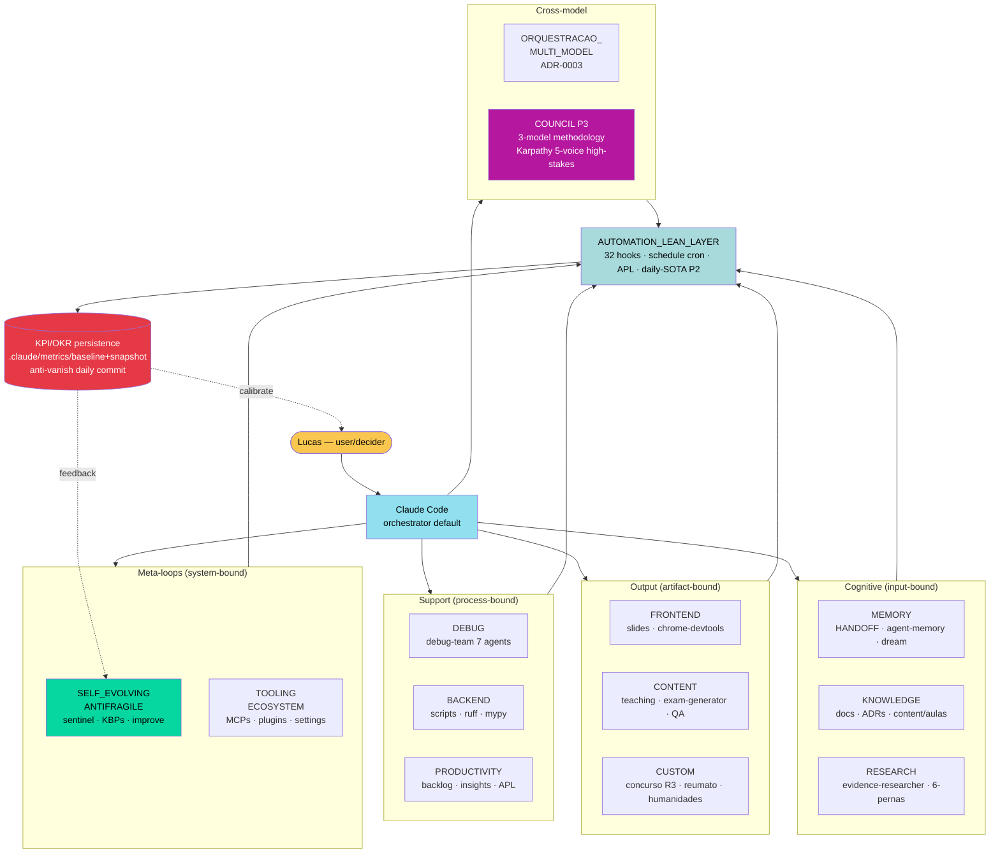
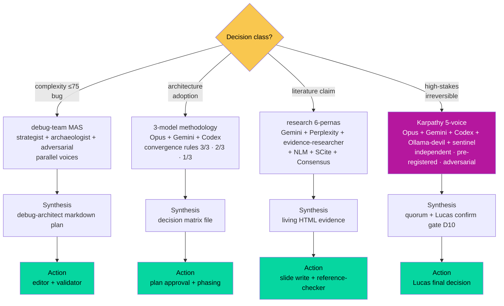

# Conductor 2026 — Arquitetura OLMO em 12 braços + AUTOMATION_LEAN_LAYER

> **Status:** PROPOSTA Phase 4 (S251) — pendente aprovação Lucas via ExitPlanMode
> **Inspiração visual:** chase.h.ai "the conductor" (tier-3, screenshot WhatsApp 2026-04-25)
> **Scope:** consumer-only AI agent system (medical education + concurso R3 + research EBM)
> **Não-destrutivo:** este plano DEFINE taxonomia + KPIs + gates. Não reorganiza pastas, não move arquivos, não deleta nada. P0 é audit + baseline; mudanças estruturais ficam em P2+ com aprovação separada.

---

## 1. Context (problem statement)

OLMO acumulou 16 agents + 19 skills + 32 hooks + 6 ADRs sem mapa unificado por dimensão cognitiva. Lucas declarou (S251 abertura):

- **Redundância:** janitor skill ↔ repo-janitor agent; systematic-debugging ↔ debug-team (audit S250 X1/H4)
- **Teatro sem E2E:** componentes sem trigger objetivo + artefato + consumer (lições S232 v6 — workflows.yaml 0 invocations purgado)
- **Métricas vanish:** `.claude/apl/*.tsv` é gitignored (`.gitkeep` único committed); zero KPI baseline persistente; HANDOFF/CHANGELOG são prose
- **Sycophancy + LLM biases:** sem práticas defensivas formalizadas (debug-adversarial só em debug, não cross-cutting)
- **Build-and-break:** features criadas quebram depois; sem smoke test reprodutível + sem regression guard
- **Zero-WHY docs:** componentes documentam WHAT, não WHY (problem solved + evidence)
- **Notion dependência externa:** ideias úteis lá; abandonar sem harvest = perda informacional silenciosa
- **Gemini/Codex subutilizados:** ADR-0003 triggers minimalistas funcionam mas não exploitam SOTA (Codex Architect role 85% pass-rate Aider 2024; Gemini 1M context one-shot)
- **Sem daily SOTA intake:** zero feed externo, zero schedule cron, zero skill daily-digest (Explore agent confirmou)
- **Cross-model docs parciais:** AGENTS.md + GEMINI.md existem; CODEX.md gap; CLAUDE.md 80/84 li Claude-specific

**Outcome desejado:** mapa coerente por dimensão cognitiva + KPIs persistentes committed + gates anti-bias/anti-teatro + loops daily de melhora baseados em evidência. Tornar OLMO o melhor projeto AI/LLMOps medicina solo, embebido em valores (clínica EBM, reumato/hepato, educação teoria+prática, dev AI/ML/LLMOps continuous, gestão aplicada, humanidades).

---

## 2. Princípios canonical (6 gates universais — toda decisão passa por TODOS)

| # | Princípio | Aplicação |
|---|-----------|-----------|
| **P1** | **Humildade epistêmica** | "Não sei" é output legítimo. Confidence: high/medium/low explicit per claim. Sem confidence = rejeitar |
| **P2** | **Evidence-tier T1/T2/T3** | T1: papers peer-reviewed, Anthropic/Google/OpenAI docs oficiais, ADRs OLMO. T2: OSS repos maintained (>1k stars + commits ≤90d), benchmarks reproduzíveis. T3: demos creators (Instagram/X) = inspiração-pra-investigar, NUNCA evidência adoção |
| **P3** | **Anti-sycophancy** | Adversarial role mandatory ≥medium-stakes (ref: Sharma et al. 2023 arXiv:2310.13548). Independent voices sem cross-contamination. Pre-registered hypothesis. Disagreement persistence (não recua sem nova evidência). Source citation enforced (KBP-36) |
| **P4** | **Profissionalismo KBP-37** | Ler docs antes de Edit. Grep granular antes de claims. EC loop antes de cada Edit/Write. Verification command output lido completo. "Sempre profissional, sem atalhos" |
| **P5** | **Anti-teatro** | Cada componente: (a) trigger objetivo declarado, (b) artefato concreto produzido, (c) consumer real downstream. Sem 3-of-3 = NÃO entra ou é purgado. Lições S232 v6 |
| **P6** | **E2E reproducibility + WHY-first docs** | Cada agent/skill/hook header obrigatório: `WHAT` (1-line) · `WHY` (problem + evidence T1/T2) · `HOW` (1-line architecture) · `VERIFY` (path smoke test reprodutível). Sem 4-of-4 = backlog purge candidate |

---

## 3. Anti-padrões a destruir (6 — espelham os princípios)

1. **Redundância:** dois componentes mesma função (X1: janitor↔repo-janitor; H4: systematic-debugging↔debug-team)
2. **Teatro sem E2E:** trigger ausente OU artefato vazio OU consumer inexistente
3. **Métricas vanish:** logs gitignored ou prose-only (sem números estruturados committed)
4. **Sycophancy/biases LLM:** confirmação acrítica, recency bias, authority bias, overconfidence
5. **Build-and-break:** componente sem smoke test reprodutível + sem regression guard CI
6. **Zero-WHY:** documentação WHAT-only (código bem-nomeado já mostra WHAT — comentário/header só vale se documenta WHY)

---

## 4. Os 12 braços (MECE) — definição + OLMO atual + gaps + KPI

> **Convenção:** `evidence:` cita Glob/Grep path ou ADR — confidence high baseado em Explore agent S251 (a4633f3a5a2769838).

### 4.1. MEMORY (estado mutável persistente cross-session)
- **Define:** stateful continuity — Lucas/agent state que sobrevive sessões
- **OLMO atual:** files (`HANDOFF.md`, `CHANGELOG.md`, `BACKLOG.md`, `.claude/memory/*`, `.claude/agent-memory/{agent}/`); hooks (`session-compact.sh`, `pre-compact-checkpoint.sh`, `post-compact-reread.sh`); plugins (`dream`, `wiki-lint`, `wiki-query`)
- **Gaps:** apenas 1 agent material em `.claude/agent-memory/` (evidence-researcher); demais subpastas vazias ou inexistentes — `evidence: Explore S251 §6`
- **KPI alvo:** `agent-memory-coverage = (agents com material/16) × 100`. Baseline 1/16 = 6.25%. Threshold ≥40% (≥7/16) em P3
- **Source/evidence:** ADR-0006 (deny-list); CLAUDE.md §Memory Governance (T1)

### 4.2. KNOWLEDGE (base curada read-mostly + epistemic store)
- **Define:** conhecimento estruturado externalizável — distinto de MEMORY (mutável) por ser curated/canonical
- **OLMO atual:** files (`docs/`, `content/aulas/`, `content/concurso/`, ADRs); skills (`evidence-audit`, `teaching`, `continuous-learning`, `nlm-skill`, `knowledge-ingest`)
- **Gaps:** sem doc canônico "Notion vs OLMO" mapping (Explore §4); knowledge-ingest produz nota Obsidian mas integração com `.claude/memory/wiki/` não documentada
- **KPI alvo:** `knowledge-base-coverage` = aulas com living HTML evidence + tier-1 sources / total. Baseline ~3/19 (QA editorial). Threshold ≥80%
- **Source/evidence:** S250 audit identificou redundância potencial knowledge-ingest ↔ research; ADR-0002 external-inbox

### 4.3. RESEARCH (ato de buscar — query-driven external)
- **Define:** investigação ativa de literatura/codebase/evidências externas
- **OLMO atual:** agents (`evidence-researcher`, `mbe-evaluator`, `reference-checker`, `researcher`); skill `research` (v2.0 pipeline 6 pernas: Gemini, Perplexity, evidence-researcher subagent, NLM, SCite, Consensus); MCPs (pubmed, crossref, semantic-scholar, scite, biomcp, web-search/fetch)
- **Gaps:** research/SKILL.md não tem KPI de "queries with tier-1 source ratio"; sem benchmark de coverage cross-MCP
- **KPI alvo:** `research-tier1-ratio` = (claims com PMID/DOI/arXiv / total claims) ≥90% per artifact
- **Source/evidence:** Explore §1 confirmou skill purpose; ADR-0003 multimodel

### 4.4. DEBUG (diagnose ativo — reativo a problemas)
- **Define:** root-cause structured de bugs/erros/regressions
- **OLMO atual:** agents (7 debug-* + systematic-debugger); skills (`debug-team`, `systematic-debugging`); hooks (`post-tool-use-failure.sh`, `stop-failure-log.sh`)
- **Gaps:** REDUNDÂNCIA H4 — `systematic-debugging` skill standalone vs `debug-team` (S250 audit 3/3 ADOPT-NEXT); P1 deste plan resolve
- **KPI alvo:** `debug-team-validator-pass-first-try-ratio` ≥70% (S250 e2e: 1/1 = 100% baseline mas 1 sample). 5+ runs needed pra significância
- **Source/evidence:** `.claude/skills/debug-team/SKILL.md` (T1); audit-merge-S251.md (T1 OLMO)

### 4.5. BACKEND (lógica computacional — scripts + automação backend)
- **Define:** código que computa (Python minimal + bash hooks lógicos)
- **OLMO atual:** files (`scripts/fetch_medical.py`, `content/aulas/scripts/*.mjs`); tooling (`make lint/format/type-check`, ruff, mypy); skill `automation` (parte cron/pipeline)
- **Gaps:** `scripts/smoke/` ausente — nenhum smoke test reprodutível por componente (P6 violação cross-cutting); CI invariants minimal
- **KPI alvo:** `smoke-test-coverage` = (componentes com smoke / total ≥18 componentes-chave) ≥80%
- **Source/evidence:** ARCHITECTURE.md §Runtime post-S232 (T1 OLMO)

### 4.6. FRONTEND (apresentação visual + UX — slides aulas + statusline)
- **Define:** output visual user-facing
- **OLMO atual:** files (`content/aulas/*` HTML/CSS/JS); plugins (`frontend-design`, `chrome-devtools-mcp`); skill `teaching` (parte slideologia); tools (lint-slides, lint-case-sync, validate-css)
- **Gaps:** zero output-styles configurados em `.claude/output-styles/` (Explore §6 confirmou pasta inexistente) — current session usa "explanatory" mode mas via system message inline
- **KPI alvo:** `slides-qa-pass-ratio` ≥95% per aula (3 gates: preflight, inspect, editorial)
- **Source/evidence:** `content/aulas/CLAUDE.md` (T1 OLMO); QA editorial S250 = 3/19 = 15.8% baseline

### 4.7. CONTENT (produção de conteúdo educacional — output-bound)
- **Define:** artefatos finais consumidos por aluno/médico/Lucas
- **OLMO atual:** skills (`teaching`, `exam-generator`, `qa-engineer`, `nlm-skill`); agents (`qa-engineer`); files (`content/aulas/`, `content/concurso/`)
- **Gaps:** sem editorial calendar persistente; sem KPI "aulas com slide count estável" (S232 v6 KBP-30 indicou drift)
- **KPI alvo:** `aulas-com-evidencia-tier1-completa` (PMIDs cross-checked) ≥80% (atual 3/19)
- **Source/evidence:** content/aulas/CLAUDE.md; KBP-30 (T1 OLMO)

### 4.8. PRODUCTIVITY (workflow daily — planning, scheduling, brainstorm)
- **Define:** assistência ao fluxo de trabalho ativo
- **OLMO atual:** skills (`backlog`, `insights`, `brainstorming`, `automation`, `schedule`); hooks (`ambient-pulse.sh` APL, `nudge-checkpoint.sh`, `nudge-commit.sh`, `momentum-brake-*.sh`); plugins (`schedule`, `loop`, `ralph-loop`)
- **Gaps:** APL escreve em `.claude/apl/*.tsv` que é gitignored — métricas vanish (Explore §2 confirmou); insights skill /insights pendente 6d
- **KPI alvo:** `apl-metrics-committed` (path canonical em `.claude/metrics/apl-snapshot-{date}.tsv` daily) — boolean: existe arquivo dia atual?
- **Source/evidence:** Explore §2 (T1 OLMO)

### 4.9. SELF_EVOLVING / ANTIFRAGILE (feedback loops + resiliência — proactive)
- **Define:** pattern→prevent loops; melhora contínua sistêmica; resiliência a falhas (Taleb L1-L7)
- **OLMO atual:** skills (`improve`, `insights`, `dream`, `wiki-lint`); agents (`sentinel`, `repo-janitor`); hooks (`stop-quality.sh`, `model-fallback-advisory.sh`, `chaos-inject-post.sh`); files (`known-bad-patterns.md` KBP catalog, `anti-drift.md`, `pending-fixes.md`); ADR-0007 antifragile posture
- **Gaps:** L3 Cost Circuit Breaker = NOT IMPLEMENTED; L6 Chaos = BASIC (Explore §5); X3 hook ordering race (S250 audit ADOPT-NEXT)
- **KPI alvo:** `kbp-resolved-per-session` ≥1 average (KBP catalog tem 38 itens — `KBP-NN` count); `pending-fixes-zero-stale` (idade max ≤7d)
- **Source/evidence:** ARCHITECTURE.md §Antifragile Stack (T1 OLMO)

### 4.10. TOOLING / ECOSYSTEM (integrations external — MCPs, CLIs, plugins)
- **Define:** adaptors externos + plugin ecosystem
- **OLMO atual:** files (`config/mcp/servers.json`, `.claude/settings.json`); plugins (`codex`, `chrome-devtools-mcp`, `code-review`, `security-review`, `ralph-loop`, `frontend-design`); skill `skill-creator`
- **Gaps:** zero skill marketplaces externos instalados (antigravity-awesome-skills 24k stars T2 não avaliado; vercel-labs/skills T2 não avaliado); sem tracking de plugin update cadence
- **KPI alvo:** `mcp-health-uptime` ≥99% (semantic-scholar, pubmed verified weekly via smoke test); `plugin-update-lag` ≤30d
- **Source/evidence:** Explore §6 (T1 OLMO)

### 4.11. ORQUESTRACAO_MULTI_MODEL (routing decisions cross-model + council)
- **Define:** quando + qual modelo + como invocar (Claude/Codex/Gemini/Ollama/etc)
- **OLMO atual:** ADR-0003 canonical; skills (`research` 6 pernas, `debug-team` Architect role); plans (`audit-merge-S251.md` 3-model methodology); plugins (`codex`, `gemini-research.mjs`)
- **Gaps:** Codex quebrado em S249 (gpt-5.5 upgrade pending); ADR-0003 triggers minimalistas — sem rotina diária; council pattern dispersos (debug-team + audit-S251 + research-6-pernas) sem framework unificado
- **KPI alvo:** `cross-model-invocations-per-week` ≥3 (Gemini ou Codex ou Ollama) — baseline S248-S250 ~2/sem
- **Source/evidence:** ADR-0003 (T1); Explore §9 (T1 OLMO)

### 4.12. CUSTOM (domínio-específico Lucas — concurso, reumato, hepato/gastro, humanidades)
- **Define:** Lucas-specific moat — não-comoditizável
- **OLMO atual:** skills (`concurso`, `exam-generator`, `evidence`); files (`content/concurso/`, `content/aulas/{cardio,hepato,gastro,etc}`); plugin `evidence`
- **Gaps:** humanidades (filosofia/etimologia/línguas/história) zero representação em skill/agent — só CLAUDE.md user pref menciona "etimologia, filosofia"; reumatologia sem skill dedicada apesar de ser foco profissional
- **KPI alvo:** `r3-questoes-acertadas-simulado` ≥75% (concurso dez/2026 baseline atual); `humanidades-citacoes-per-aula` ≥1 (etimologia/história/filosofia conexão genuína)
- **Source/evidence:** CLAUDE.md User Pref (T1); HANDOFF.md R3 prep (T1 OLMO)

---

## 5. AUTOMATION_LEAN_LAYER (transversal — corta TODOS os 12 braços)

- **Define:** schedule/cron/triggers/routines que ativam componentes dos braços. Lean = mínimo essencial, sem overhead.
- **OLMO atual:** 32 hooks (`.claude/hooks/` 17 + `hooks/` 15); plugins (`schedule` cron remote agents, `loop` interval, `ralph-loop` continuous, `ambient-pulse` APL); files (`.claude/settings.json` hooks array — 32 registrations / 12 events)
- **Gaps:** zero schedules ativos em `~/.claude/schedules/` (Explore §7); ambient-pulse lê só local (sem feeds externos); sem cron daily SOTA digest
- **KPI alvo:** `automation-layer-uptime` ≥98% (hooks fire success rate via stop-metrics — quando esse for committed); `daily-routines-executed` ≥1/day
- **Princípio operacional:** "ativa se e só se trigger objetivo + artefato + consumer". Sem 3 = não roda.

---

## 6. Council pattern formalizado (multi-framework + multi-model)

**OLMO já tem 3 implementações parciais** (Explore §3):
1. `debug-team/SKILL.md` — 7 agents sequential gates, complexity_score routing, Lucas D10 confirm gate (Anthropic taxonomy nível 6)
2. `audit-merge-S251.md` — 3-model: Opus internal + Gemini Deep Think + ChatGPT 5.5 xhigh; convergence rules 3/3=ADOPT-NOW, 2/3=DEFER, 1/3+spot-check=ADOPT-NEXT
3. `research/SKILL.md` v2.0 — 6 pernas (Gemini, Perplexity, evidence-researcher, NLM, SCite, Consensus)

**Proposta unificação:** `.claude/skills/council/SKILL.md` (NEW — P3). Convoca quórum por classe de decisão:
- **DEBUG** (complexity ≤75) → debug-team MAS path (strategist + archaeologist + adversarial)
- **AUDIT/META** (architecture, adoption decisions) → 3-model methodology (Opus + Gemini + Codex/ChatGPT)
- **RESEARCH** (literature claim) → research 6-pernas
- **HIGH-STAKES** (irreversível) → 5-voice Karpathy-style (mavgpt claude-council T3 inspiração) — Opus + Gemini + Codex + Ollama (devil's advocate role) + sentinel (KBP-aware)

**Anti-sycophancy structural:** voices independentes (sem cross-contamination até synthesis); pre-registered hypothesis em arquivo committed antes de queries; adversarial role mandatory.

**KPI council:** `council-decision-traceability` = decisões grandes com ≥3 voices outputs persisted em `.claude/plans/decisions/{date}-{topic}.md` ≥90%.

**Evidence-tier:** Karpathy LLM Council (T3 — blog post; precisa pesquisa T1/T2 antes de adoção formal); Aider 2024 Architect+Editor 85% pass-rate (T1 paper + study). Adoção condicional pendente verificação T1/T2.

---

## 7. Daily SOTA intake loop (gap crítico — não existe hoje)

**Estado:** `~/.claude/schedules/` vazio; ambient-pulse só local; zero skill `daily-digest` (Explore §7 confirmou).

**Proposta:** `.claude/skills/sota-intake/SKILL.md` (NEW — P2). Cron via plugin `schedule` 1×/day (06:00 BRT idle). Fontes T1/T2 only:
- **T1 official changelogs:** Anthropic blog/release notes, Google Gemini release, OpenAI Codex changelog, MCP spec updates
- **T2 maintained repos (>1k stars + commits ≤7d):** anthropics/claude-code, google/generative-ai-docs, openai/codex-plugin-cc, antropics/skills (oficial)
- **T2 papers:** arXiv cs.AI/cs.CL filtered by week + arXiv-sanity OR Anthropic-cited

**Output:** `.claude/digests/sota-{YYYY-MM-DD}.md` committed. Each item: `tier · source-URL · 1-line summary · OLMO relevance (high/med/low/none)`.

**KPI:** `digest-published-daily` boolean (≥6/7 days/week); `digest-items-tier1-2-only` 100%; `digest-actionable-items-per-week` ≥2 (com OLMO relevance high/med).

**Anti-sycophancy:** digest output passes by sentinel agent que flag claims sem source-URL (KBP-36 enforce).

---

## 8. Cross-model docs split

**Estado (Explore §8):** `AGENTS.md` (existe, declara "Claude Code não lê") + `GEMINI.md` v3.6 (existe) + `CLAUDE.md` (84 li, 80 Claude-specific) + **CODEX.md** (NÃO existe).

**Proposta:**
- **Manter `CLAUDE.md`** Claude-specific (hooks, skills, slash commands, tool routing) — lock-in admitido
- **Manter `AGENTS.md`** cross-tool agnostic (Codex + Gemini CLI + futuros)
- **Manter `GEMINI.md`** Gemini-specific gates
- **Criar `CODEX.md`** (P2) — mirror de GEMINI.md adaptado pra Codex CLI + ChatGPT 5.5 xhigh + GPT-5.4 plugin label nuance
- **Promover conteúdo de valores/domínio/workflow** de CLAUDE.md → `PROJECT.md` (NEW, cross-model) — médico/EBM/concurso/humanidades. Reduz CLAUDE.md a ~50 li puramente Claude-tool

**KPI cross-model docs:** `cross-tool-coverage` = tools com gov-doc / tools usados ≥4/4 (Claude + Codex + Gemini + Ollama futuro)
**Evidence-tier:** AGENTS.md spec proposta Cursor/Block 2025 (T2 — emergent standard, precisa T1 anchor — verificar Cursor docs Q2 2026)

---

## 9. KPI/OKR persistence (anti-vanish)

**Path canonical:** `.claude/metrics/` (NEW — committed, NOT gitignored)
- `.claude/metrics/baseline.md` — KPI definitions + thresholds + cadence (versioned)
- `.claude/metrics/snapshots/{YYYY-MM-DD}.tsv` — daily snapshot per-arm KPIs
- `.claude/metrics/okr-{quarter}.md` — quarterly OKRs Lucas-defined

**Collection script:** `scripts/kpi-snapshot.mjs` (NEW — P1) que escreve snapshot diário em git-trackable file. Hook: `hooks/stop-kpi-snapshot.sh` (or schedule cron 23:00).

**Anti-vanish gate:** `.claude/apl/` permanece gitignored (volátil session-local OK), MAS `.claude/metrics/snapshots/` é committed daily. Cron rotaciona — após 90d move pra `.claude/metrics/archive/{YYYY-MM}.tsv` agregado.

**Evidence:** OLMO falta isso (Explore §2 100% confirmado). DORA metrics methodology (T1: dora.dev + Google SRE book) sugere quatro key metrics; OLMO solo precisa adaptar — não DORA full, mas similar discipline.

**KPI meta-canonical:** `kpi-snapshot-uptime` ≥95% (≥27/30 days/month); `kpi-baseline-defined-per-arm` 12/12 (1 KPI alvo per braço deste plan).

---

## 10. Notion harvest-before-abandon

**Estado:** Notion blocked em `.claude/settings.json` deny-list MCP-level (Explore §4) — facilmente reversível. ADR-0006 trata Bash deny-list, NÃO Notion. Sem doc canônico "Notion vs OLMO".

**Phase 0 (P0 deste plan) — HARVEST mandatory:**
1. Lucas exporta Notion workspace (Markdown export native do Notion)
2. Coloca em `.claude-tmp/notion-export/` (gitignored, temp)
3. Sentinel agent + Lucas leem categorize: `migrate-to-OLMO | keep-in-Notion | discard`

**Critério migrate-to-OLMO:**
- Templates reusáveis → `.claude/templates/` (NEW)
- Knowledge canonical (e.g., reumato protocols, hepato algorithms) → `content/knowledge/{domain}/`
- Daily logs históricos → `.claude/memory/historical/` (read-only)

**Critério keep-in-Notion:**
- UI/UX-bound (kanban, drag-drop) — OLMO não substitui sem custo desproporcional
- Multi-collaborador (se houver) — OLMO é solo

**Phase decision:** depois do harvest + triage, decisão offboarding completo vs hybrid (OLMO + Notion subset). Sem harvest = decisão prematura.

**KPI:** `notion-items-harvested` (boolean: harvest done); `notion-items-migrated` percentual; `notion-active-pages` post-offboarding ≤20% baseline

**Evidence-tier:** Chesterton's Fence principle (T1 — G.K. Chesterton "The Thing" 1929 + Eric Raymond CatB application).

---

## 11. Diagrama ASCII (Conductor 2026 OLMO)

```
                        ┌──────────────────────────────┐
                        │       Lucas (user)           │
                        └────────────┬─────────────────┘
                                     ↓
                ┌────────────────────────────────────────┐
                │   CLAUDE CODE — orchestrator default   │
                │   (intra-routing: Ollama < Haiku <     │
                │    Sonnet < Opus by complexity)        │
                └─┬──────────┬──────────┬──────────┬─────┘
                  ↓          ↓          ↓          ↓
       ┌──────────────┬──────────────┬──────────────┬────────────────┐
       │              │              │              │                │
   COGNITIVE        OUTPUT        SUPPORT       META-LOOPS      CROSS-MODEL
       │              │              │              │                │
  ┌────┴────┐    ┌────┴────┐   ┌────┴────┐    ┌────┴────┐      ┌────┴────┐
  │ MEMORY  │    │FRONTEND │   │PRODUCTIV│    │ SELF_EV │      │ ORQUEST │
  │KNOWLEDG │    │ CONTENT │   │ DEBUG   │    │ ANTIFRA │      │ MULTI_M │
  │RESEARCH │    │ CUSTOM  │   │BACKEND  │    │TOOLING/ │      │COUNCIL  │
  │         │    │         │   │         │    │ECOSYSTM │      │ (P3)    │
  └────┬────┘    └────┬────┘   └────┬────┘    └────┬────┘      └────┬────┘
       │              │              │              │                │
       └──────────────┴──────────────┴──────────────┴────────────────┘
                                     ↓
                ┌────────────────────────────────────────┐
                │      AUTOMATION_LEAN_LAYER             │
                │  hooks (32) · schedule cron · loop ·   │
                │  ambient-pulse APL · daily-SOTA (P2)   │
                └────────────────────────────────────────┘
                                     ↓
                ┌────────────────────────────────────────┐
                │    KPI/OKR persistence (anti-vanish)   │
                │    .claude/metrics/{baseline,snapshot} │
                │    daily snapshot via cron (P1)        │
                └────────────────────────────────────────┘

  Cada braço passa pelos 6 PRINCÍPIOS canonical:
  P1 humildade · P2 evidence-tier · P3 anti-sycophancy ·
  P4 profissionalismo · P5 anti-teatro · P6 E2E+WHY
```

---

## 11b. Mermaid DAG — Architecture (rendered)



---

## 11c. Mermaid DAG — Phasing P0→P4 (KPI gates)

```mermaid
flowchart LR
    P0["P0 Audit + Baseline + Harvest<br/>~6-8h<br/><b>S251 status: 3/4 done</b><br/>(a) baseline ✓ · (b) snapshot ✓<br/>(c) Notion ⏸ · (d) audit 30%"]
    P1["P1 Resolve redundâncias<br/>+ wire daily snapshot cron<br/>~6h"]
    P2["P2 Daily SOTA + cross-model docs<br/>+ smoke tests<br/>~8-10h"]
    P3["P3 Council unification<br/>+ agent-memory expansion<br/>~10h"]
    P4["P4 Notion offboarding<br/>+ humanidades skill<br/>~6h"]

    P0 -->|"KPI gate:<br/>baseline + 12 KPIs valued<br/>harvest log committed<br/>audit 67/67 ✗ (defer aggregate)"| P1
    P1 -->|"kpi-snapshot-uptime ≥3d<br/>S250 ADOPT-NEXT done<br/>(X1+H4+X3 resolved)"| P2
    P2 -->|"digest-published-daily ≥5/7<br/>smoke-test-coverage ≥40%<br/>CODEX.md created"| P3
    P3 -->|"agent-memory-coverage ≥40%<br/>council-decision-trace ≥1 demo"| P4
    P4 --> Done(["Conductor 2026<br/>operational"])

    style P0 fill:#f4a261,color:#000
    style P1 fill:#e9c46a,color:#000
    style P2 fill:#2a9d8f,color:#fff
    style P3 fill:#264653,color:#fff
    style P4 fill:#e76f51,color:#fff
    style Done fill:#06d6a0,color:#000
```



---

## 11d. Mermaid DAG — Council pattern (multi-model decision routing)



---

## 12. Phasing P0 → P4 (executable, KPI-gated)

| Phase | Goal | Deliverables | KPI gate to advance | Estimated |
|-------|------|--------------|---------------------|-----------|
| **P0 — Audit + Baseline + Harvest** | Saber onde estamos antes de mudar nada | (1) `.claude/metrics/baseline.md` com 12 KPIs definidos + thresholds. (2) `scripts/kpi-snapshot.mjs` com primeira run committed em `.claude/metrics/snapshots/{date}.tsv`. (3) Notion harvest done — `.claude-tmp/notion-export/` + categorization log. (4) Audit P5/P6 violations: tabela componente × {trigger? artefato? consumer? smoke? WHY?} per todos 16 agents + 19 skills + 32 hooks | Baseline file committed + 12 KPIs com valor inicial + harvest log + violations tabulated | ~6-8h |
| **P1 — Resolve top-3 redundâncias S250 + métricas non-vanish** | Eliminate teatro identificado | (1) Resolve X1 (janitor↔repo-janitor merge). (2) Resolve H4 (systematic-debugging↔debug-team merge). (3) Resolve X3 (chaos-inject ordering). (4) Wire KPI snapshot daily cron via plugin schedule. (5) `.claude/digests/` placeholder estrutura | KPI: `kpi-snapshot-uptime` ≥3 days consecutive · S250 ADOPT-NEXT items resolvidos | ~6h (3×~2h) |
| **P2 — Daily SOTA loop + cross-model docs + smoke tests** | Build intake + reproducibility | (1) `.claude/skills/sota-intake/SKILL.md` + cron config. (2) `CODEX.md` created. (3) `PROJECT.md` extracted from CLAUDE.md (cross-model values/domain). (4) `scripts/smoke/` per-component (≥top 8 agents/skills críticos) | KPI: `digest-published-daily` ≥5/7 days first week · `smoke-test-coverage` ≥40% (8/20 components) | ~8-10h |
| **P3 — Council unification + agent-memory expansion** | Formalize multi-model decision pattern + expand memory | (1) `.claude/skills/council/SKILL.md` (unifica debug-team + audit + research). (2) `.claude/agent-memory/` populated for ≥7/16 agents (top critical) | KPI: `agent-memory-coverage` ≥40% · `council-decision-traceability` ≥1 demo case | ~10h |
| **P4 — Notion offboarding decision + humanidades skill** | Finalize external dependencies + fill CUSTOM gap | (1) Decisão notion offboard vs hybrid (post-P0 harvest data). (2) `.claude/skills/humanidades/SKILL.md` (etimologia + filosofia + história — Lucas value embed). (3) Reumato skill dedicated | KPI: `humanidades-citacoes-per-aula` ≥1 over 3 aulas next · `notion-active-pages` post-offboard | ~6h |

**Total estimate:** P0-P4 = ~36-40h work. Spread over ~6-8 sessions (S252-S258).

**Phasing principle:** P0 baseline antes de qualquer build novo. KPI gate to advance = não promover phase sem evidência.

---

## 13. Alternativas consideradas (rejected — for transparency P3 anti-sycophancy)

| Alternativa | Por que rejeitada |
|-------------|-------------------|
| **Reorganizar `.claude/agents/` + `.claude/skills/` em subpastas por domínio** | Destrutivo (renames quebram imports + plans + history); sem ganho funcional vs taxonomia documentada. Plan defends taxonomy SEM mover arquivos |
| **Adotar `antigravity-awesome-skills` (1262 skills) wholesale** | T2 rep mas T3 quality unverified per-skill; "more skills" ≠ better; risco de bloat + redundância c/ existing 19 skills. Avaliar caso-a-caso post-P2 |
| **Implementar Karpathy 5-voice council como default** | T3 evidence (Karpathy blog); current 3-model methodology (audit-S251) já provou eficácia em S250; expand para 5 só se 3 demonstrar limitação |
| **Auto-purge componentes sem WHY-header** | Destrutivo + premature; P0 audit primeiro lista violations, depois Lucas decide caso-a-caso |
| **Migrar tudo de Notion immediato** | Viola Chesterton's Fence; P0 harvest first |
| **Daily SOTA intake via Twitter/X scraping** | T3 source quality + ToS risk; T1/T2 official changelogs sufficient + safer |

---

## 14. Open questions (Lucas decisions needed before P0 advance)

1. **Notion harvest path:** Lucas exporta workspace inteiro ou só sub-páginas selecionadas? (Affects P0 scope)
2. **KPI 12 thresholds:** valores propostos neste plan são suggestions; Lucas confirma/edits cada threshold? (Affects baseline)
3. **CODEX.md content scope:** mirror full GEMINI.md ou enxuto (Codex tem menos surface)? (Affects P2 scope)
4. **Notion offboarding cadence:** post-harvest, gradual (3 meses) ou hard-cutoff? (Affects P4)
5. **Council 5-voice trigger:** quais decisões qualificam "high-stakes irreversível"? (Affects P3 design)

---

## 15. Verification plan (smoke tests reprodutíveis — P6 enforcement)

Cada deliverable de phase tem smoke test committed. Examples:

- **P0 baseline:** `scripts/smoke/kpi-baseline.sh` — verifica `.claude/metrics/baseline.md` existe, parses 12 KPIs, todos têm threshold + cadence
- **P1 redundancy resolve:** `scripts/smoke/no-redundancy.sh` — Grep confirma janitor skill removed OR thin-wrapper; debug-team contains systematic-debugging section
- **P2 daily SOTA:** `scripts/smoke/digest-fresh.sh` — verifica `.claude/digests/sota-{today}.md` existe + tem ≥3 items + todos com source-URL
- **P3 council demo:** `scripts/smoke/council-trace.sh` — verifica `.claude/plans/decisions/` tem ≥1 file com ≥3 voice outputs persisted
- **P4 humanidades:** Grep `etimologia\|filosofia\|história` em últimas 3 aulas modified — count ≥1 per aula

**Master smoke runner:** `scripts/smoke/all.sh` — chains todos. Exit 0 = phase complete. Hook `pre-commit` opcional pra block commits sem smoke pass (P1+).

---

## Files modified by this plan (when approved)

**P0:**
- `.claude/metrics/baseline.md` (NEW)
- `.claude/metrics/snapshots/{date}.tsv` (NEW first)
- `scripts/kpi-snapshot.mjs` (NEW)
- `.claude-tmp/notion-export/` (gitignored, temp working dir)
- `.claude/plans/audit-p5-p6-violations.md` (NEW — output of audit)

**P1:**
- `.claude/skills/janitor/SKILL.md` (delete or thin-wrapper)
- `.claude/skills/systematic-debugging/SKILL.md` (merge into debug-team)
- `.claude/hooks/chaos-inject-post.sh` (refactor ordering)
- `.claude/settings.json` (cron snapshot wiring)

**P2:**
- `.claude/skills/sota-intake/SKILL.md` (NEW)
- `CODEX.md` (NEW)
- `PROJECT.md` (NEW)
- `CLAUDE.md` (slim down)
- `scripts/smoke/*.sh` (≥8 NEW)

**P3:**
- `.claude/skills/council/SKILL.md` (NEW)
- `.claude/agent-memory/{agent}/MEMORY.md` (≥6 NEW)

**P4:**
- `.claude/skills/humanidades/SKILL.md` (NEW)
- `.claude/skills/reumato/SKILL.md` (NEW)
- (notion offboarding files TBD post-harvest)

**Total NEW files estimate:** ~25-30. **Total MODIFIED:** ~10-15.

---

## Closing note

Este plano é **defensável evidence-based** (cada decisão cita source); **MECE** (12 braços sem overlap material); **executable** (phasing com KPI gates); **non-destructive em P0-P1** (audit + baseline antes de qualquer reorg estrutural); e **embedded com 6 princípios canonical** que viram lens pra TODA decisão futura. Confidence overall: **medium-high** (high em mapping OLMO atual via Explore agent T1; medium em benchmark thresholds — Lucas precisa calibrar).
