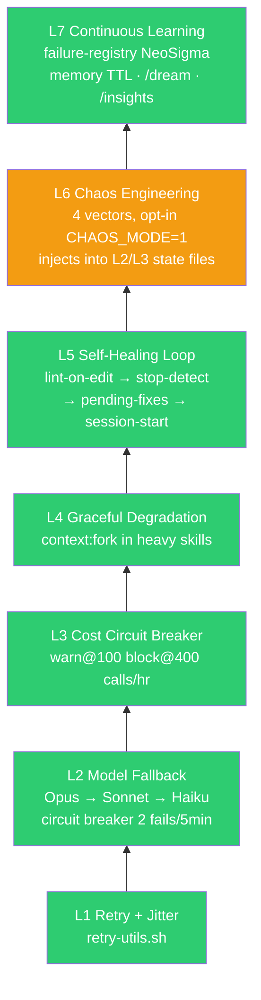
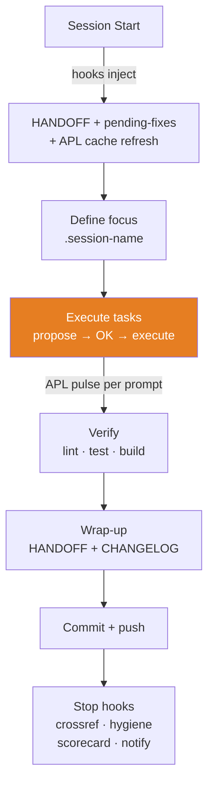

# Arquitetura do OLMO

> Claude Code agent system for medical education and exam prep (consumer-only).
> **Consumer side** (producer em OLMO_COWORK — ver ADR-0002).
> Estado: S232 | 2026-04-19 (generic-snuggling-cloud v6 — adversarial consolidation + Python stack purge).

## Runtime (post-S232 v6)

**Não há runtime Python agent.** S232 removeu do repo versionado: `orchestrator.py`, `__main__.py`, `agents/`, `subagents/`, `tests/` (Python), `config/loader.py`, `config/ecosystem.yaml`, `config/rate_limits.yaml` — stack era vestigial/falido/nunca usado (0 hook invocations, 0 external consumers; manual `make run`/`status` raramente). `git ls-files agents/ subagents/ tests/` confirmam vazio. Resíduo filesystem local (`__pycache__` gitignored) pode persistir em clones e não afeta o repo.

**Orquestração real acontece em Claude Code:**
- 9 subagents em `.claude/agents/*.md` (Task tool, MCPs próprios, maxTurns)
- 18 skills em `.claude/skills/*/SKILL.md` (invocadas via Skill tool ou triggers)
- 30 hooks em `.claude/hooks/` + `hooks/` (event-driven: PreToolUse, PostToolUse, Stop, etc.)
- MCP connections: shared inventory em `config/mcp/servers.json`; agent-scoped MCPs inline em `.claude/agents/*.md` (ver §MCP Connections abaixo); policy runtime em `.claude/settings.json`

**Regra** (canônica em `.claude/rules/anti-drift.md` §Propose-before-pour): Lucas decide, agente executa.

**Nota histórica deleções sequenciais** (Python purge 4 sessões):
- S228: `Cientifico` + `AtualizacaoAI` + analyzers/monitors (producer-side → OLMO_COWORK)
- S229: `Organizacao` + `KnowledgeOrganizer` + `NotionCleaner` + `notion/` pkg
- S230: `SmartScheduler` + `LocalFirstSkill` + `ModelRouter` (teatro arquitetural)
- S232 v6: `workflows.yaml` + `load_workflows()` (aspirational, 0 runtime)
- S232 post-close: **Python stack total** — `orchestrator.py`, `agents/`, `subagents/`, `tests/`, `config/loader.py`, `ecosystem.yaml`, `rate_limits.yaml`

## Claude Code Subagents (9)

> `.claude/agents/*.md` invocados via Task tool dentro do Claude Code, com MCPs + maxTurns próprios.

| Agent | Model | maxTurns | Memory | Role |
|-------|-------|----------|--------|------|
| evidence-researcher | Sonnet | 35 | project | Multi-MCP research, living HTML |
| qa-engineer | Sonnet | 12 | project | 1 slide, 1 gate, 1 invocation |
| mbe-evaluator | Sonnet | 15 | — | GRADE/CONSORT/STROBE (FROZEN) |
| reference-checker | Haiku | 15 | project | PMID cross-ref, stale data |
| quality-gate | Haiku | 10 | — | Lint, type-check, tests |
| researcher | Haiku | 15 | — | Codebase exploration |
| repo-janitor | Haiku | 12 | — | Orphan files, dead links |
| sentinel | Sonnet | 25 | project | Read-only self-improvement, anti-pattern detection |
| systematic-debugger | Sonnet | 25 | project | 4-phase structured debugging |

## Memory (canonical layout)

**Per-agent memory** = `.claude/agent-memory/{agent-name}/` — only agent with material memory currently is `evidence-researcher` (6 topic files + MEMORY.md index). Agents create subdir on first write; empty subdirs (qa-engineer, sentinel, reference-checker) are tolerated as placeholder but NOT canonical state.

**User-global memory** = `~/.claude/memory/` — Lucas-wide cross-project (outside OLMO repo scope; managed via `/dream` + `/wiki-lint` plugin skills).

**NOT IN USE** (S232 v6 cleanup):
- `AgentContext.shared_memory` — dead field deleted from `agents/core/base_agent.py`
- Project-level global memory layer — intentionally absent; per-agent isolation is canonical

## Hook Pipeline

```mermaid
graph LR
    UPS[UserPromptSubmit] --> SS[SessionStart] --> PT[PreToolUse] --> TU[Tool Use] --> PO[PostToolUse] --> S[Stop]

    UPS --- ups1[ambient-pulse.sh<br>APL: 5-slot rotation]
    SS --- ss1[session-start.sh<br>session-compact.sh<br>apl-cache-refresh.sh]
    PT --- pt1[9 guards:<br>read-secrets · write-unified<br>plan-exit · bash-secrets<br>bash-write · lint-before-build<br>research-queries · mcp-queries<br>momentum-brake-enforce]
    PO --- po1[post-bash-handler<br>lint-on-edit L5<br>nudge-checkpoint<br>coupling-proactive<br>chaos-inject-post L6<br>model-fallback L2<br>post-global-handler]
    S --- s1[prompt: silent-exec guard<br>agent: hygiene check<br>stop-quality (merged)<br>stop-metrics (merged)<br>stop-notify · integrity]

    style UPS fill:#e67e22,color:#fff
    style SS fill:#4a9eff,color:#fff
    style PT fill:#ff6b6b,color:#fff
    style TU fill:#ffd93d,color:#000
    style PO fill:#6bcb77,color:#fff
    style S fill:#9b59b6,color:#fff
```

**30 scripts · 32 hook registrations em `settings.json`** (10 eventos: SessionStart · UserPromptSubmit · PreToolUse · PostToolUse · Notification · PreCompact · PostCompact · Stop · PostToolUseFailure · SessionEnd + 2 inline Stop hooks).
APL (Ambient Productivity Layer): 3 hooks — pulse per prompt, cache at start, scorecard at stop.
**Control plane (canonical):** `.claude/settings.json` = hooks array + permissions (deny/allow). `.claude/settings.local.json` = user-specific overrides ONLY (permissions.allow for per-user tool auth; NOT hook registrations). Agents auditing hook health must check `settings.json:hooks[]`, never `.local.json`. Reference: `.claude/hooks/README.md`.

## Antifragile Stack (Taleb L1-L7)



| Layer | Status S93 | Key files |
|-------|-----------|-----------|
| L1 | DONE | `.claude/hooks/lib/retry-utils.sh` |
| L2 | DONE | `.claude/hooks/model-fallback-advisory.sh` |
| L3 | NOT IMPLEMENTED | cost-circuit-breaker.sh removed — behavior unlinked (S230 audit) |
| L4 | DONE | `context:fork` in skills |
| L5 | DONE | `lint-on-edit.sh`, `stop-detect-issues.sh` |
| L6 | BASIC | `chaos-inject-post.sh` + `lib/chaos-inject.sh` (stop-chaos-report absorvido/removido — reporting gap) |
| L7 | DONE | `failure-registry.json`, memory TTL, `/dream`, `/insights` |

Design doc: `docs/research/chaos-engineering-L6.md`

## Content Pipeline (Aulas)


```
content/aulas/
├── shared/              # Design system (OKLCH, deck.js, GSAP engine)
├── metanalise/          # 19 slides — active development
├── cirrose/             # 11 slides
├── grade/               # 58 slides — needs redesign
├── scripts/             # Linters: lint-slides.js, gemini-qa3.mjs, export-pdf.js
├── CLAUDE.md            # Aula-specific rules (cascades from root)
└── package.json         # dev, build, lint, QA scripts
```

**Patterns:** assertion-evidence (`<h2>` = claim, visual = evidence), declarative animation (`data-animate`), OKLCH design tokens, 1280x720 viewport.

## MCP Connections (3 camadas)

**Shared inventory** (`config/mcp/servers.json`) — declarações compartilhadas com lifecycle tags:

| MCP | Category | Lifecycle |
|-----|----------|-----------|
| PubMed, SCite, Consensus | Medical | connected |
| Scholar Gateway | Medical | connected (**frozen** per evidence-researcher S128) |
| NotebookLM, Zotero | Study | connected |
| Notion | Productivity | connected |
| Canva, Excalidraw | Visual | connected |

**Agent-scoped** (`.claude/agents/*.md` `mcpServers:` block, **fora** do shared inventory):
- `evidence-researcher`: pubmed, crossref, **semantic-scholar**, scite, biomcp (5 agent-scoped MCPs + claude.ai PubMed fallback)
- `reference-checker`: pubmed

**Policy gate** (`.claude/settings.json`) — governa callable em runtime:
- `pre-approved` (allow): `mcp__pubmed__*`, `mcp__biomcp__*`, `mcp__crossref__*`, `mcp__claude_ai_{PubMed,Consensus,SCite}__*`
- `blocked by deny`: `mcp__claude_ai_{Notion,Canva,Excalidraw,Scholar_Gateway,Gmail,Google_Calendar}__*`, `mcp__zotero__*`
- `not pre-approved by current policy` (unlisted): demais (ex: NotebookLM, semantic-scholar)

**Inventoriado ≠ callable.** Cruzar shared inventory × policy gate antes de afirmar runtime status. Scholar Gateway ≠ Semantic Scholar (primeiro = shared inventory frozen; segundo = agent-scoped).

Gemini: CLI OAuth ($0) + API key (scripts QA) — **não MCP**. Perplexity: API direta — **não MCP**.

**Migrated S228-S229 → OLMO_COWORK (ADR-0002):** Gmail (S228, email scan/classify/publish); daily org agents + Notion write subagents (S229).

## Notion Crosstalk Pattern (S229 — historical pattern, currently blocked)

Pattern documentado S229: Notion audit + add_content operava via **Claude Code (OLMO) + MCP Notion direct** em sessão interativa Lucas+Claude. **Runtime atual: `mcp__claude_ai_Notion__*` está blocked by deny em `.claude/settings.json`. Uso exige reativação manual da policy (mover deny→allow).** NÃO existe Python subagent ou workflow batch.

**Rationale:** Python pipeline async era mais lento que crosstalk síncrono. Claude Code pode classificar, auditar, adicionar conteúdo e confirmar inline — Lucas aprova em tempo real, rollback imediato disponível. Para operações pontuais (1-N páginas), crosstalk supera COWORK handoff assíncrono.

**Quando usar crosstalk (OLMO):** audit pontual, add_content interativo, dedupe com decisão humana.
**Quando usar OLMO_COWORK:** producer pipeline (harvest → classify → publish em lote), sem humano no loop.

Infra: MCP Notion **inventariado** em `config/mcp/servers.json`; runtime atual = **blocked by deny** em `.claude/settings.json`. Ativação requer mover deny→allow manualmente. Código Python batch não preservado (S229).

## Model Routing

**Intra-Claude** (complexity-based, CLAUDE.md §Efficiency):
```
trivial → Ollama ($0)  │  simple → Haiku  │  medium → Sonnet  │  complex → Opus
```

**Cross-model orchestration** — ver [`docs/adr/0003-multimodel-orchestration.md`](adr/0003-multimodel-orchestration.md) para framework 5-critérios (objetivo/trigger/artefato/custo/risco) + invocation gates Claude Code ↔ Codex ↔ Gemini ↔ Ollama + deferral rationale (Antigravity, ChatGPT deflate).

**Cost**: $0 tier — Claude Code Max + Gemini CLI OAuth + Codex ChatGPT. API keys only for QA scripts.

## Daily/Weekly Workflow

### Session Cycle (each session)



### Daily

1. **Start session** — hooks surface HANDOFF + pending-fixes automatically
2. **Pick focus** — from HANDOFF proximos passos (P0 first, then P1)
3. **Work** — propose/OK/execute cycle. Max 2 subagents. Commit early.
4. **Wrap** — update HANDOFF (future-only) + CHANGELOG (append-only)
5. **Inbox pull** — `/digest-pull` or `/research-pull` reads artifacts from `$OLMO_INBOX` (producer = OLMO_COWORK)

### Weekly

1. **Monday** — review `.claude/BACKLOG.md`, pick week's priorities
2. **Mid-week** — `/insights` if 3+ sessions since last run (cadence: every 3-4 sessions)
3. **Friday** — `/dream` memory consolidation (auto-triggered every 24h via hook)
4. **Every 3 sessions** — memory governance: check merge candidates, TTL dates

### Cadences

| What | Frequency | Next |
|------|-----------|------|
| `/insights` | Every 3-4 sessions | S94 |
| Memory governance | Every 3 sessions | S95 |
| MCP pinning review | Quarterly | S95 |
| `/dream` consolidation | Auto 24h | Hook-driven |

## Project Structure

```
OLMO/
├── CLAUDE.md                # Root instructions (85 lines)
├── HANDOFF.md               # Session state (future-only, ~50 lines)
├── CHANGELOG.md             # Session history (append-only)
├── .claude/BACKLOG.md       # Prioritized work items + setup checklist
├── .claude/
│   ├── settings.json        # Hook registrations + permissions + env vars
│   ├── settings.local.json  # Local overrides (permissions only)
│   ├── rules/ (5)           # Anti-drift, KBPs, QA pipeline, slide/design rules
│   ├── skills/ (18)         # Progressive disclosure (loaded on demand)
│   ├── agents/ (9)          # Subagent definitions with model routing
│   ├── hooks/ (17 + lib/)   # Guards + antifragile hooks
│   │   └── lib/             # retry-utils.sh, chaos-inject.sh
│   ├── apl/                 # Ambient Productivity Layer cache (gitignored)
│   ├── insights/            # failure-registry.json, reports
│   └── plans/               # Session plans
├── hooks/ (13)              # Lifecycle + APL: session-start, stop-*, ambient-pulse, apl-cache, nudge-commit, post-compact-reread, session-end
├── config/
│   └── mcp/servers.json     # MCP server configs (pinned versions)
├── content/aulas/           # Node.js subsystem (deck.js + GSAP + Vite)
├── docs/                    # Architecture, workflows, research
│   └── research/            # Implementation plans, chaos design doc
└── docker-compose.yml       # OTel Collector + Langfuse + Postgres + ClickHouse
```

## Architectural Principles

1. **Human-in-the-loop** — Lucas decides, agent executes (Karpathy)
2. **Antifragile** — system gets stronger from failures, not just resilient (Taleb)
3. **Via Negativa** — remove what fails > add guardrails. KBPs > more rules
4. **Reversibility** — every agent action must be reversible (Anthropic)
5. **Modelo certo** — smallest model that solves the task (efficiency)
6. **Referenciamento** — PMID, DOI mandatory for medical content
7. **Curiosidade** — explain why, not just what. Teach during, not after

## Related Documents

- `docs/research/implementation-plan-S82.md` — Master roadmap (antifragile, self-improvement)
- `docs/research/chaos-engineering-L6.md` — L6 design doc
- `content/aulas/STRATEGY.md` — Slide tech roadmap (CSS @layer, D3, Lottie)
- `docs/coauthorship_reference.md` — AI coauthorship policy
- `docs/mcp_safety_reference.md` — MCP security protocol

---

Coautoria: Lucas + Opus 4.7 | S228 (slim consumer migration)
