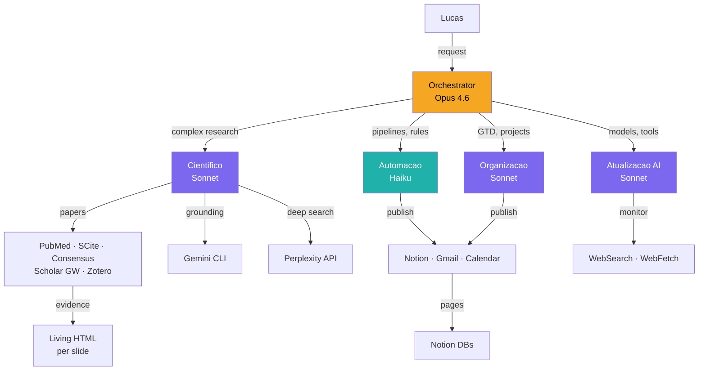
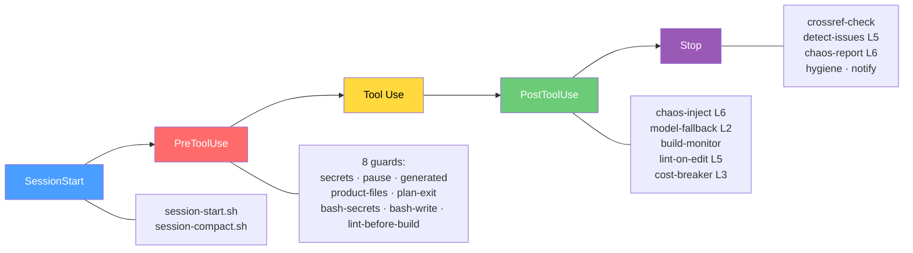
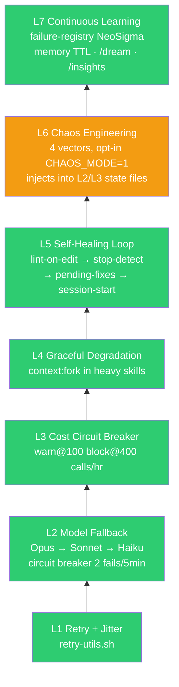
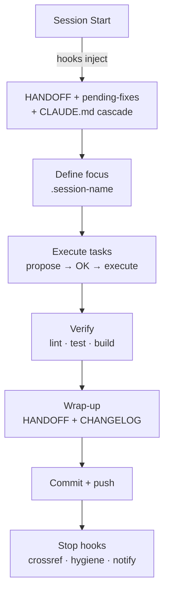

# Arquitetura do Ecossistema OLMO

> AI agent ecosystem for medical education, research, and exam prep.
> Estado: S93 | 2026-04-06

## Orchestrator DAG



**Regra**: Lucas decide, agente executa. Sem OK explicito = nao fazer.

## Agents (8)

| Agent | Model | maxTurns | Memory | Role |
|-------|-------|----------|--------|------|
| evidence-researcher | Sonnet | — | project | Multi-MCP research, living HTML |
| qa-engineer | Sonnet | 12 | project | 1 slide, 1 gate, 1 invocation |
| mbe-evaluator | Sonnet | 15 | — | GRADE/CONSORT/STROBE (FROZEN) |
| reference-checker | Haiku | 15 | project | PMID cross-ref, stale data |
| quality-gate | Haiku | 10 | — | Lint, type-check, tests |
| researcher | Haiku | 15 | — | Codebase exploration |
| repo-janitor | Haiku | 12 | — | Orphan files, dead links |
| notion-ops | Haiku | 10 | — | Notion CRUD with MCP safety |

## Hook Pipeline



**22 hooks total** (20 Claude Code + 1 PreCompact + 1 git pre-commit).
Config: `.claude/settings.local.json`. Reference: `.claude/hooks/README.md`.

## Antifragile Stack (Taleb L1-L7)



| Layer | Status S93 | Key files |
|-------|-----------|-----------|
| L1 | DONE | `.claude/hooks/lib/retry-utils.sh` |
| L2 | DONE | `.claude/hooks/model-fallback-advisory.sh` |
| L3 | DONE | `.claude/hooks/cost-circuit-breaker.sh` |
| L4 | DONE | `context:fork` in skills |
| L5 | DONE | `lint-on-edit.sh`, `stop-detect-issues.sh` |
| L6 | BASIC | `chaos-inject.sh`, `chaos-inject-post.sh`, `stop-chaos-report.sh` |
| L7 | DONE | `failure-registry.json`, memory TTL, `/dream`, `/insights` |

Design doc: `docs/research/chaos-engineering-L6.md`

## Content Pipeline (Aulas)


```
content/aulas/
├── shared/              # Design system (OKLCH, deck.js, GSAP engine)
├── metanalise/          # 19 slides — active development
├── cirrose/             # 11 slides
├── grade/               # 58 slides — needs redesign
├── scripts/             # Linters: lint-slides.js, gemini-qa3.mjs, export-pdf.js
├── CLAUDE.md            # Aula-specific rules (cascades from root)
└── package.json         # dev, build, lint, QA scripts
```

**Patterns:** assertion-evidence (`<h2>` = claim, visual = evidence), declarative animation (`data-animate`), OKLCH design tokens, 1280x720 viewport.

## MCP Connections (11)

| Category | MCPs | Used by |
|----------|------|---------|
| Medical | PubMed, SCite, Consensus, Scholar Gateway | evidence-researcher, /research |
| Study | NotebookLM, Zotero | /nlm-skill, reference management |
| Productivity | Notion, Gmail, Google Calendar | notion-ops, /daily-briefing |
| Visual | Excalidraw, Canva | diagrams, design |

Gemini: CLI OAuth ($0) + API key (scripts). Perplexity: API direta (not MCP).

## Model Routing

```
trivial → Ollama ($0)  │  simple → Haiku  │  medium → Sonnet  │  complex → Opus
```

**Cost**: $0 tier — Claude Code Max + Gemini CLI OAuth + Codex ChatGPT. API keys only for QA scripts.

## Daily/Weekly Workflow

### Session Cycle (each session)



### Daily

1. **Start session** — hooks surface HANDOFF + pending-fixes automatically
2. **Pick focus** — from HANDOFF proximos passos (P0 first, then P1)
3. **Work** — propose/OK/execute cycle. Max 2 subagents. Commit early.
4. **Wrap** — update HANDOFF (future-only) + CHANGELOG (append-only)
5. **Email** — `/daily-briefing` for Gmail triage + Notion digest (optional)

### Weekly

1. **Monday** — review BACKLOG.md, pick week's priorities
2. **Mid-week** — `/insights` if 3+ sessions since last run (cadence: every 3-4 sessions)
3. **Friday** — `/dream` memory consolidation (auto-triggered every 24h via hook)
4. **Every 3 sessions** — memory governance: check merge candidates, TTL dates

### Cadences

| What | Frequency | Next |
|------|-----------|------|
| `/insights` | Every 3-4 sessions | S94 |
| Memory governance | Every 3 sessions | S95 |
| MCP pinning review | Quarterly | S95 |
| `/dream` consolidation | Auto 24h | Hook-driven |

## Project Structure

```
OLMO/
├── CLAUDE.md                # Root instructions (85 lines)
├── HANDOFF.md               # Session state (future-only, ~50 lines)
├── CHANGELOG.md             # Session history (append-only)
├── BACKLOG.md               # Prioritized work items
├── .claude/
│   ├── settings.local.json  # Hook registration + env vars
│   ├── rules/ (10)          # Anti-drift, KBPs, QA pipeline, session hygiene
│   ├── skills/ (20)         # Progressive disclosure (loaded on demand)
│   ├── agents/ (8)          # Subagent definitions with model routing
│   ├── hooks/ (11)          # Guards + antifragile hooks
│   │   └── lib/             # retry-utils.sh, chaos-inject.sh
│   ├── insights/            # failure-registry.json, reports
│   └── plans/               # Session plans
├── hooks/ (11)              # Lifecycle: session-start, stop-*, pre-compact, chaos-report
├── config/
│   ├── ecosystem.yaml       # Agent routing + skills
│   └── mcp/servers.json     # MCP server configs (pinned versions)
├── content/aulas/           # Node.js subsystem (deck.js + GSAP + Vite)
├── tests/ (53)              # pytest suite
├── docs/                    # Architecture, workflows, research
│   └── research/            # Implementation plans, chaos design doc
└── docker-compose.yml       # OTel Collector + Langfuse + Postgres + ClickHouse
```

## Architectural Principles

1. **Human-in-the-loop** — Lucas decides, agent executes (Karpathy)
2. **Antifragile** — system gets stronger from failures, not just resilient (Taleb)
3. **Via Negativa** — remove what fails > add guardrails. KBPs > more rules
4. **Reversibility** — every agent action must be reversible (Anthropic)
5. **Modelo certo** — smallest model that solves the task (efficiency)
6. **Referenciamento** — PMID, DOI mandatory for medical content
7. **Curiosidade** — explain why, not just what. Teach during, not after

## Related Documents

- `docs/research/implementation-plan-S82.md` — Master roadmap (antifragile, self-improvement)
- `docs/research/chaos-engineering-L6.md` — L6 design doc
- `docs/WORKFLOW_MBE.md` — MBE research workflow
- `docs/PIPELINE_MBE_NOTION_OBSIDIAN.md` — Research pipeline details
- `content/aulas/STRATEGY.md` — Slide tech roadmap (CSS @layer, D3, Lottie)
- `docs/coauthorship_reference.md` — AI coauthorship policy
- `docs/mcp_safety_reference.md` — MCP security protocol

---

Coautoria: Lucas + Opus 4.6 | S93
